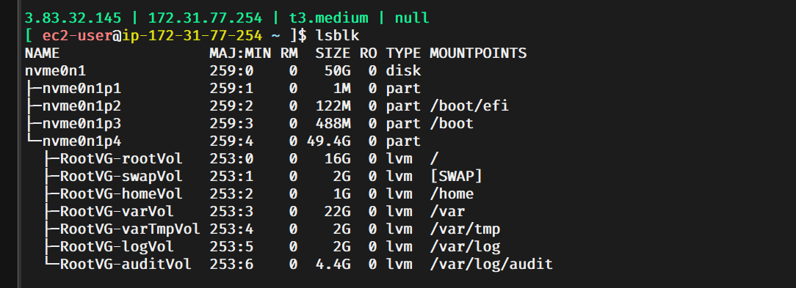

## Linux Disk Expansion Script

    growpart /dev/nvme0n1 4 || true
    lvextend -L +30G /dev/RootVG/varVol || true
    lvextend -L +10G /dev/RootVG/homeVol || true
    xfs_growfs / || true
    xfs_growfs /home || true

 
 
    This sequence of commands is a safe script commonly used on Linux systems (especially cloud instances like AWS EC2 with NVMe disks) to expand disk space after you've increased the underlying block storage volume size (e.g., from the cloud provider console).

    It assumes:

        The disk is /dev/nvme0n1 (typical for modern AWS EC2 instances).
        There is a partition 4 on that disk that contains an LVM Physical Volume (PV).
        The LVM setup has a Volume Group named RootVG.
        Inside that VG, there are Logical Volumes: one for /var (varVol), one for /home (homeVol), and likely another (e.g., rootVol) mounted on / (root filesystem).
        The filesystems on / (root) and /home are XFS (common on RHEL/CentOS/Amazon Linux).

##  Step-by-step explanation of what each command does:

    growpart /dev/nvme0n1 4 || true
    growpart is a tool (from the cloud-utils-growpart package) that resizes a partition to use all available free space on the disk.
    Here, it extends partition number 4 (/dev/nvme0n1p4) to fill the newly added space on the disk.
    The || true means: if the command fails (e.g., no extra space or partition already max size), just continue instead of stopping the script.
    Effect: Makes the partition larger so LVM can see the new space.

    lvextend -L +30G /dev/RootVG/varVol || true
    lvextend extends a Logical Volume in LVM.
    Adds 30 GB of space to the logical volume /dev/RootVG/varVol (which is typically mounted on /var).
    It takes the space from free extents in the Volume Group (made available by the previous growpart step).
    Again, || true ignores failures (e.g., if not enough free space).

    lvextend -L +10G /dev/RootVG/homeVol || true
    Same as above, but adds 10 GB to /dev/RootVG/homeVol (typically mounted on /home).

    xfs_growfs / || true
    xfs_growfs expands an XFS filesystem to use all space in its underlying device.
    Here, it grows the XFS filesystem mounted on / (the root filesystem, which is usually another LV like /dev/RootVG/rootVol).
    Note: It doesn't explicitly extend that LV — it assumes the extra space from the disk/partition growth went to the root LV (or there was already free space in the VG allocated to it).

    xfs_growfs /home || true
    Grows the XFS filesystem mounted on /home (from the extended homeVol).

##  Overall purpose:

    This script safely expands available disk space on a running system after you've enlarged the virtual disk (e.g., AWS EBS volume).
    It prioritizes giving 30 GB to /var and 10 GB to /home, while any remaining new space typically ends up usable by the root filesystem (/).
    The || true makes it idempotent and safe to run multiple times — failed steps won't halt everything.
    It's common in automation/scripts for cloud instances where disk resizing happens frequently.

    Important notes:

    Run these as root (or with sudo).
    Always backup important data first — resizing operations are usually safe online, but errors can happen.
    If your system uses ext4 instead of XFS, you'd use resize2fs instead of xfs_growfs.
    Check your setup first with lsblk, df -h, pvs, vgs, lvs to confirm the layout matches (e.g., is partition 4 the LVM one? Are filesystems XFS?).