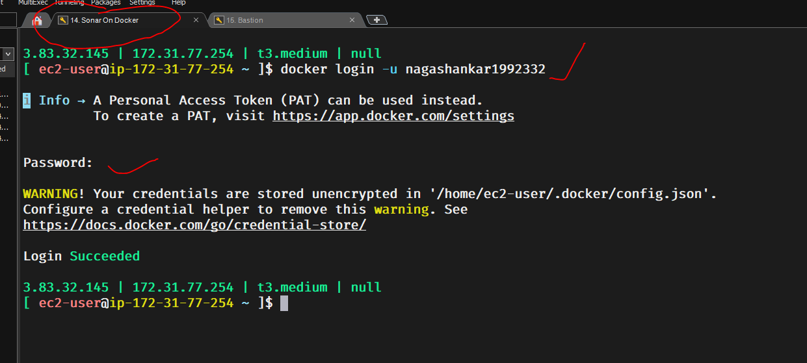

## Terraform AWS EKS Infrastructure

    Here the resources depends on eachother while they are getting created.

    Here, 
        SG is dependent on VPC
        ALB is dependent on SG and 
        Bastion, EKS and ACM are independent, so then can be created parllelly.

    This dependency is maintained while we are creating the infra using the Jenkins pipelines.
    Even if we are creating manually via terraform, make sure VPC is created first and then proceed with the other services.

    Look at the below image, to understand about upstream-downstream

## Commands to install & delete the resources

    For creating the resources, we need to manually go in to all the folders (00-vpc 10-sg 20-bastion 30-ecr 60-acm 70-frontend 80-eks) and perform the necessary commands like terraform init, terraform plan, terraform apply -auto-approve

    But, while deleting, we delete them in a single go by using the below command

    for i in 80-eks 70-frontend-alb 60-acm 20-bastion 10-sg 00-vpc ; do
        cd $i
        terraform destroy -auto-approve
        cd ..
    done

    But make sure, every resource is deleted properly. Check in the AWS console.
    
    
    This repository provisions a complete AWS infrastructure using modular Terraform components. It is designed for scalability, reusability, and clarity, following best practices for infrastructure-as-code. Each module represents a distinct component of the architecture and can be applied independently or orchestrated via CI/CD pipelines.

Below are the total no of resources going to be created from this repo for 00-vpc

Below are the total no of resources going to be created from this repo for 10-sg

Below are the total no of resources going to be created from this repo for 70-frontend-alb

## Steps to be followed after creating these INFRA

    On Jenkins-Agent
        backend repo -> CI 
        backend deploy -> CD
    1. create infra
    2. EKS setup
            allow jenkins agent sg in eks control plane (Manually go to EKS security groups > edit > inbound > https > no pasthe the SG of Jenkins Agent(EC2) and save it.)
            create namespace (kubectl create ns roboshop)
            create DB pods
	        mongodb redis mysql rabbitmq
    3. we can deploy applications

    aws configure
    provide the accesskey and secretkey
    aws eks update-kubeconfig --region us-east-1 --name roboshop-dev
    kubectl get nodes

========================

This is the readme.md from grok

# Terraform AWS Infrastructure for EKS (RoboShop Project)

This repository provisions a modular, scalable AWS infrastructure using Terraform for hosting applications on Amazon EKS. It includes:

- VPC with public/private/database subnets
- Security Groups
- Bastion host for secure access
- ECR repositories
- IAM roles and policies
- ACM certificates
- Frontend Application Load Balancer (ALB)
- EKS cluster

Resources are split into independent/dependent modules for easier management and parallel applies where possible.

## Prerequisites

- An AWS account with billing enabled (note: some resources may incur costs; monitor via AWS Cost Explorer).
- A Route53 hosted zone for your domain.
- Terraform installed locally (`>= 1.5` recommended).
- AWS CLI configured with admin credentials locally.
- Create `terraform.tfvars` in each module directory with required variables (e.g., `project = "roboshop"`, `environment = "dev"`, CIDR blocks, zone ID, etc.).
- Prepare `bastion.sh` script (see improved version below) in the `20-bastion` directory.
- Prepare `iam-policy.json` for IRSA (e.g., ALB Controller) if needed.

## Module Dependencies & Apply Order

Apply in this order (due to dependencies like SG depending on VPC, ALB on SG):

1. `00-vpc`
2. `10-sg`
3. Parallel: `20-bastion`, `30-ecr`, `40-iam`, `60-acm`
4. `70-frontend-alb`
5. `80-eks`

##  Key Improvements & Best Practices (to Avoid Future Issues)
1. IAM Role for Bastion/EKS Access
The bastion uses an IAM instance profile (e.g., "TerraformAdmin" role from 40-iam). To enable aws eks update-kubeconfig on the bastion:

Attach the managed policy AmazonEKSClusterPolicy to the role.

Add this to your 40-iam/main.tf (or wherever the role is defined):
    resource "aws_iam_role_policy_attachment" "terraform_admin_eks_cluster" {
  role       = aws_iam_role.terraform_admin.name  # Adjust to your role resource name
  policy_arn = "arn:aws:iam::aws:policy/AmazonEKSClusterPolicy"
}

Run terraform apply in 40-iam. This ensures every bastion has EKS describe permissions from day one (avoids manual CLI attachment).

2. Improved bastion.sh (in 20-bastion)

    Update your bastion.sh with these enhancements for up-to-date tools and AWS CLI v2:

    #!/bin/bash

# Expand root and home volumes (as in original)
growpart /dev/nvme0n1 4
lvextend -L +20G /dev/RootVG/rootVol
lvextend -L +10G /dev/RootVG/homeVol
xfs_growfs /
xfs_growfs /home

# Install Docker
dnf -y install dnf-plugins-core
dnf config-manager --add-repo https://download.docker.com/linux/rhel/docker-ce.repo
dnf install docker-ce docker-ce-cli containerd.io docker-buildx-plugin docker-compose-plugin -y
systemctl start docker
systemctl enable docker
usermod -aG docker ec2-user

# Install latest AWS CLI v2 (critical for 'aws eks' commands)
curl "https://awscli.amazonaws.com/awscli-exe-linux-x86_64.zip" -o "awscliv2.zip"
unzip awscliv2.zip
sudo ./aws/install --update
rm -rf awscliv2.zip aws

# Install eksctl (latest)
ARCH=amd64
PLATFORM=$(uname -s)_$ARCH
curl -sLO "https://github.com/eksctl-io/eksctl/releases/latest/download/eksctl_$PLATFORM.tar.gz"
tar -xzf eksctl_$PLATFORM.tar.gz -C /tmp
sudo mv /tmp/eksctl /usr/local/bin/eksctl
rm eksctl_$PLATFORM.tar.gz

# Install latest kubectl
curl -LO "https://dl.k8s.io/release/$(curl -L -s https://dl.k8s.io/release/stable.txt)/bin/linux/amd64/kubectl"
sudo install -o root -g root -m 0755 kubectl /usr/local/bin/kubectl
rm kubectl

# Install Helm
curl -fsSL -o get_helm.sh https://raw.githubusercontent.com/helm/helm/main/scripts/get-helm-3
chmod 700 get_helm.sh
./get_helm.sh
rm get_helm.sh

# Optional: kubectx/kubens for context switching
git clone https://github.com/ahmetb/kubectx /opt/kubectx
ln -s /opt/kubectx/kubens /usr/local/bin/kubens

## 3. Post-Deployment: Accessing EKS from Bastion

After creating the bastion and EKS:

SSH into bastion: ssh -i <key.pem> ec2-user@<bastion-public-ip>
Verify role: aws sts get-caller-identity (should show TerraformAdmin role)
Generate kubeconfig: aws eks update-kubeconfig --region us-east-1 --name roboshop-dev
Test: the versions
kubectl get nodes
kubectl version --client
helm version
eksctl version
aws --version

Never run aws configure with static keys on the bastion (it overrides role credentials).
Cleanup old creds if present: rm -f ~/.aws/credentials ~/.aws/config
Post-Infra Deployment Steps (e.g., for RoboShop App)

Create namespace: kubectl create ns roboshop
Deploy databases (MongoDB, Redis, MySQL, RabbitMQ) via Helm or manifests.
Build/push images to ECR.
Deploy microservices (frontend, catalogue, user, cart, etc.) with Helm/charts.
 

## Below is the script to install databases via bastion.sh (already these are installed)
#!/bin/bash

set -e  # Exit on any error

### Update system
sudo yum update -y

### Install kubectl
curl -LO "https://dl.k8s.io/release/$(curl -L -s https://dl.k8s.io/release/stable.txt)/bin/linux/amd64/kubectl"
sudo install -o root -g root -m 0755 kubectl /usr/local/bin/kubectl
kubectl version --client

### Install Helm
curl https://raw.githubusercontent.com/helm/helm/main/scripts/get-helm-3 | bash
helm version

### Add Bitnami Helm repository
helm repo add bitnami https://charts.bitnami.com/bitnami
helm repo update

### Create namespace if not exists
kubectl create namespace roboshop --dry-run=client -o yaml | kubectl apply -f -

### Deploy MongoDB
helm upgrade --install mongodb bitnami/mongodb \
  --namespace roboshop \
  --set auth.enabled=false \
  --set persistence.size=10Gi \
  --wait

### Deploy Redis
helm upgrade --install redis bitnami/redis \
  --namespace roboshop \
  --set auth.enabled=false \
  --set architecture=standalone \
  --set master.persistence.size=10Gi \
  --wait

### Deploy MySQL
helm upgrade --install mysql bitnami/mysql \
  --namespace roboshop \
  --set auth.rootPassword=roboshop123 \
  --set auth.database=roboshop \
  --set primary.persistence.size=10Gi \
  --wait

### Deploy RabbitMQ
helm upgrade --install rabbitmq bitnami/rabbitmq \
  --namespace roboshop \
  --set auth.username=roboshop \
  --set auth.password=roboshop123 \
  --set persistence.size=10Gi \
  --wait

echo "All databases deployed successfully in roboshop namespace!"

## Bastion Host Verifications

  source ~/.bashrc
  
  aws --version
  kubectl version --client
  helm version
  eksctl version
  docker --version

## SonarQube Installation

  use the Docker >> docker-eks-via-terraform (docker.sh) repo to create a instance with dokcer and loginto the dockerhub from the same instance

  docker login -u nagashankar1992332   >> command
  prompts for a password, so give the below password

  password: Naga@1992

  

  sudo docker run -d --name sonarqube -p 9000:9000 sonarqube:community   >> command to launch sonarqube via docker

  publicIP:9090  in the browser to see the sonarqube and continue with the remaining Jenkins steps

