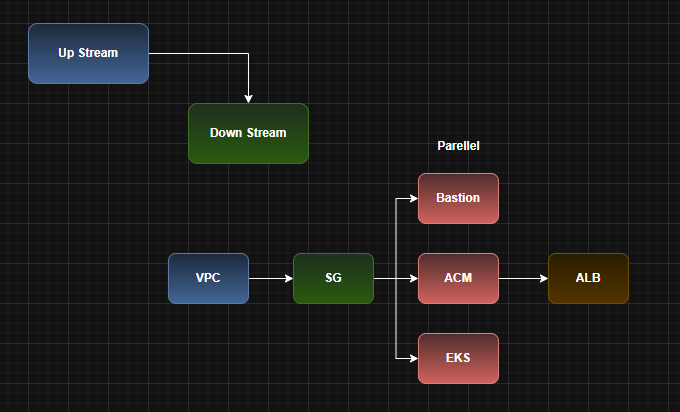
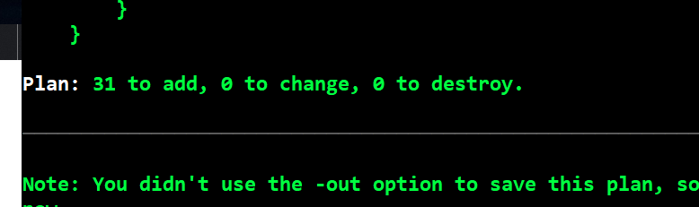
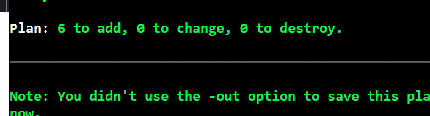

## Terraform AWS EKS Infrastructure

    Here the resources depends on eachother while they are getting created.

    Here, 
        SG is dependent on VPC
        ALB is dependent on SG and 
        Bastion, EKS and ACM are independent, so then can be created parllelly.

    This dependency is maintained while we are creating the infra using the Jenkins pipelines.
    Even if we are creating manually via terraform, make sure VPC is created first and then proceed with the other services.

    Look at the below image, to understand about upstream-downstream

## Commands to install the resources

    For creating the resources, we need to manually go in to all the folders (00-vpc 10-sg 20-bastion 30-ecr 60-acm 70-frontend 80-eks) and perform the necessary commands like terraform init, terraform plan, terraform apply -auto-approve

    But, while deleting, we delete them in a single go by using the below command

    for i in 00-vpc 10-sg 20-bastion 30-ecr 60-acm 70-frontend-alb 80-eks; do
        cd $i
        terraform destroy -auto-approve
        cd ..
    done

    But make sure, every resource is deleted properly. Check in the AWS console.
    
    
    This repository provisions a complete AWS infrastructure using modular Terraform components. It is designed for scalability, reusability, and clarity, following best practices for infrastructure-as-code. Each module represents a distinct component of the architecture and can be applied independently or orchestrated via CI/CD pipelines.

Below are the total no of resources going to be created from this repo for 00-vpc

Below are the total no of resources going to be created from this repo for 10-sg

Below are the total no of resources going to be created from this repo for 70-frontend-alb

## Steps to be followed after creating these INFRA

    On Jenkins-Agent
        backend repo -> CI 
        backend deploy -> CD
    1. create infra
    2. EKS setup
            allow jenkins agent sg in eks control plane (Manually go to EKS security groups > edit > inbound > https > no pasthe the SG of Jenkins Agent(EC2) and save it.)
            create namespace (kubectl create ns roboshop)
            create DB pods
	        mongodb redis mysql rabbitmq
    3. we can deploy applications